# 🧩 AI 3D Scene Generator

A **browser-based Three.js playground** that uses **LLMs (OpenAI, OpenRouter, Anthropic)** to generate, modify, and export **3D objects** — directly inside the browser.  
Built with **asyncLLM streaming**, **Bootstrap UI**, and a sandboxed **iframe runtime** that ensures safe execution of AI-generated code.

---

## 🚀 Features

- **LLM Integration**
  - Configure providers (OpenAI, OpenRouter, Anthropic) via API key  
  - Supports GPT-4.1, GPT-5, and Anthropic Claude models  
  - AI generates or modifies Three.js scenes from text prompts  

- **Interactive 3D Rendering**
  - Real-time Three.js rendering inside an iframe sandbox  
  - Auto-rotate, wireframe toggle, and camera reset controls  
  - Screenshot capture + display for reference  

- **Reference Image Support**
  - Upload a reference image to guide LLM-based geometry creation  
  - Side-by-side comparison with generated output  

- **Export Options**
  - Export generated 3D objects as **`.obj` files**  
  - Session history with prompt, code, and screenshots  

- **UI/UX**
  - Bootstrap 5 + Bootstrap Alerts for responsive UI  
  - Highlight.js + Marked for syntax-highlighted code previews  

---

## ⚡ How It Works

```mermaid
flowchart TD
    A[📝 User enters prompt] --> B[🖼️ Upload reference image]
    B --> C[⚡ Send prompt + reference to LLM]
    C --> D[💻 LLM generates Three.js code]
    D --> E[🎨 Render 3D object in viewer]
    E --> F{User actions}

    F -->|📦 Export OBJ| G[💾 Save/Download file]
    F -->|🔄 Modify object| H[📝 Enter new prompt]
    
    H --> I[📷 Capture current 3D screenshot]
    I --> J[⚡ Send new prompt + screenshot + reference image to LLM]
    J --> D
```



## 🔄 Workflow  

1. **Input** – Enter prompt + (optional) reference image.  
2. **LLM** – Prompt + image → LLM → Three.js code.  
3. **Render** – Code runs in iframe → 3D object with controls.  
4. **Export** – Save as **OBJ** or **screenshot**.  
5. **Iterate** – New prompt + current screenshot + reference → updated code → repeat.  

---

## ⚡ Setup & Usage  

### 1. Clone the repository  
```bash
git clone https://github.com/Nitin399-maker/3dobjectgen.git
cd 3dobjectgen
